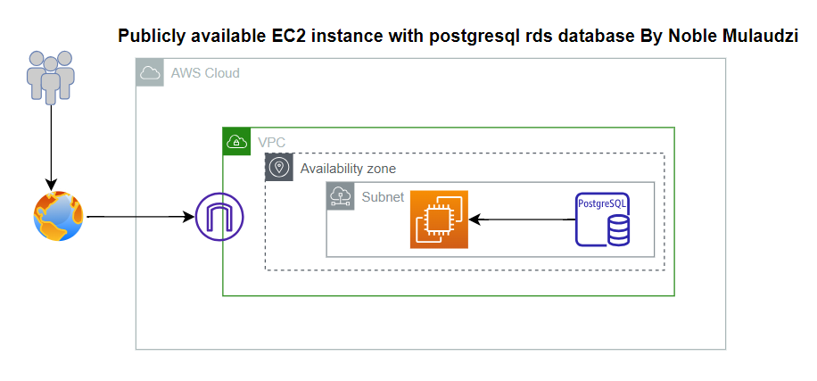

# Terraform Project: EC2 Instance, PostgreSQL RDS, VPC, Subnet

This Terraform project automates the provisioning of an EC2 instance, a PostgreSQL RDS database, a VPC, and a subnet. The EC2 instance is set up to be publicly accessible.

## Prerequisites

- Install Terraform: [Installation Guide](https://learn.hashicorp.com/tutorials/terraform/install-cli)

## Usage

1. Clone this repository to your local system:

- git clone https://github.com/Mutuwa99/4sure-Terraform.git
- navigate to the folder

2. change access keys in the providers.tf file

- aws_access_key = "your_aws_access_key"
- aws_secret_key = "your_aws_secret_key"
- region = " "

3. Initialize and apply the Terraform configuration:
- terraform init
- terraform apply

4. Remember to change the AMI in the main.tf 

Tutorial by Noble Mutuwa Isaya

